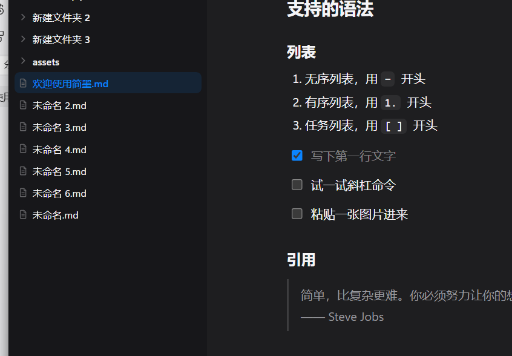

# `欢迎使用简`墨

一个安静的 Markdown 工作空间。~~大量留白、细腻的字排、克制的色~~彩——希望它能让你专注在写作本身。


后世的HOI安徽的卡JS**HDPHASDFOPIHSDFPOISAJ**DFLKJ*SLDAKJF;ASJDFLASJDF SADFL*K 

## 快速上手

- 在欢迎页点击`打开文件夹，选择任意一个文件夹作为工作空间`
- `左侧边栏可在文件与大纲之间切换（侧栏右缘可拖拽调宽）`
- `双击文件打开，停止输入约 0.6 秒后自动保存`
- 输入 `/` *呼出命令菜单，快速插入各种块*

## *支持的语法*

### 列表

1. 无序列表，用 `-`  开头
2. 有序列表，用 `1.`  开头
3. 任务列表，用 `[ ]`  开头

- [x] 写下第一行文字
- [ ] 试一试斜杠命令
- [ ] 粘贴一张图片进来

### 引用

> 简单，比复杂更难。`你必须努力让你的想法`变得清晰`明了，让它变`得简单。
> —— Steve Jobs

### 代码块

```md
```js
const greeting = '你好，简墨'
console.log(greeting)
```

```

```js
function fib(n) {
  return n < 2 ? n : fib(n - 1) + fib(n - 2)
}
```


&nbsp;

```java

```


### 表格

在表格内**右键**即可插入/删除行列、切换标题行。


| 快捷键        | 功能       | 但是发射点士大夫 |
| ---------- | -------- | -------- |
| `Ctrl + O` | 打*开文*件夹  |          |
| `Ctrl + N` | 新~~建文~~件 |          |
| `Ctrl + \` | 切换边栏     |          |
| `Ctrl + S` | 立即保存     |          |


### 图片

粘贴、拖入图片，会以原始二进制存入工作空间的 `assets/` 文件夹，文档里用相对路径引用，不转 base64。


### `链接与分割线`

`简墨的项目主页 · 外部链接按住 Ctrl 单击即可打开。`

---

`主题可以手动阀手动阀在顶栏右上角切换：发射点发生跟随系统 / 亮色 / 暗色。士大夫但是右键菜单、标题栏按钮都会一士大夫但是起跟着变。`

`祝写作愉快。`


&nbsp;



